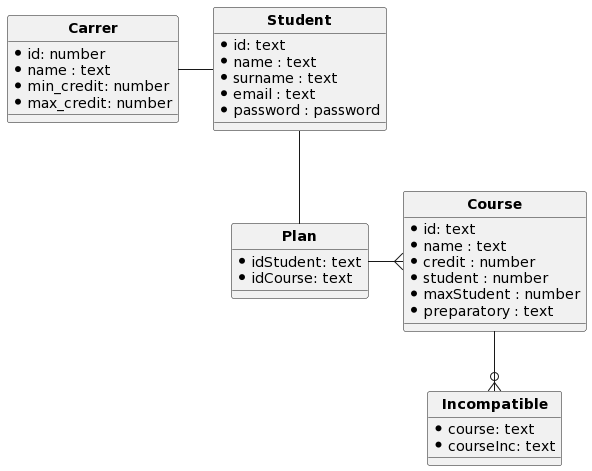
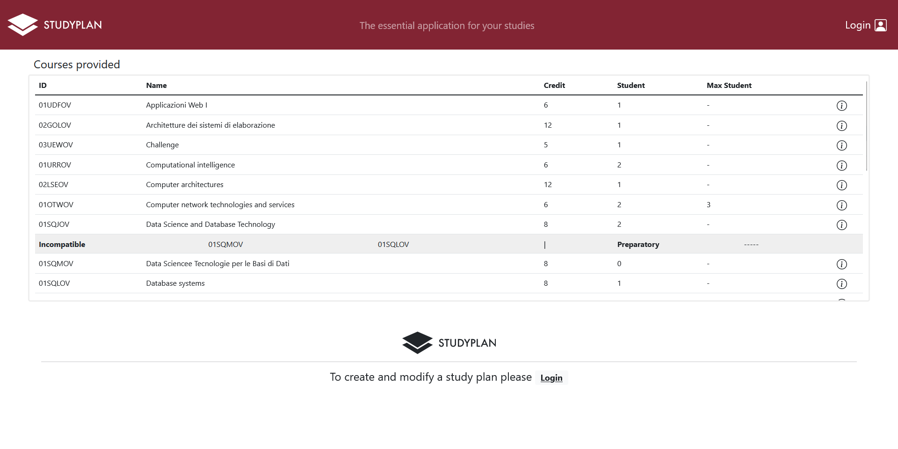
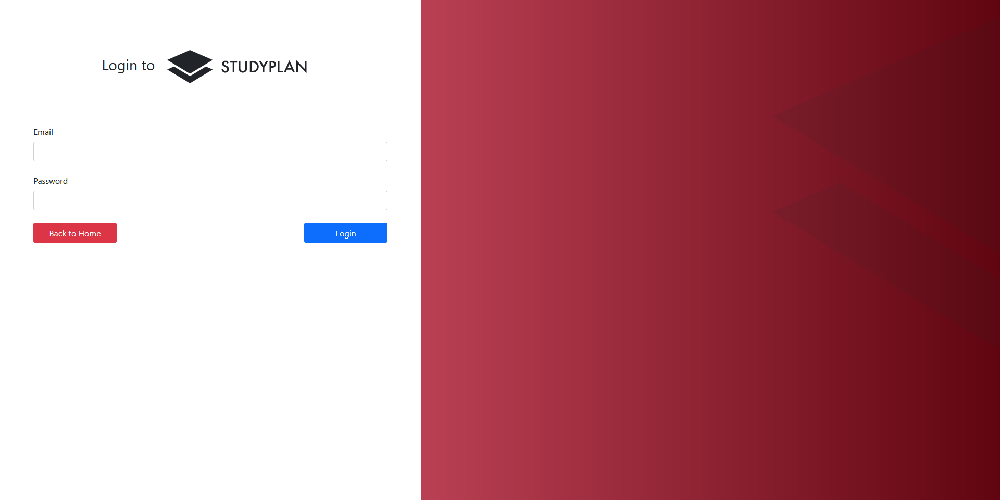
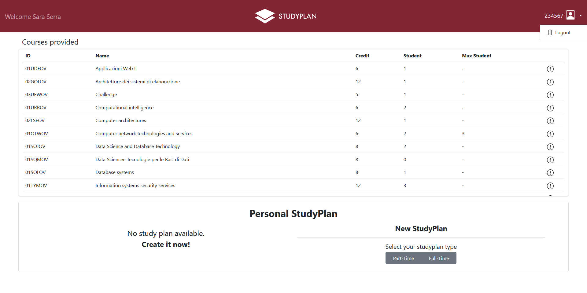
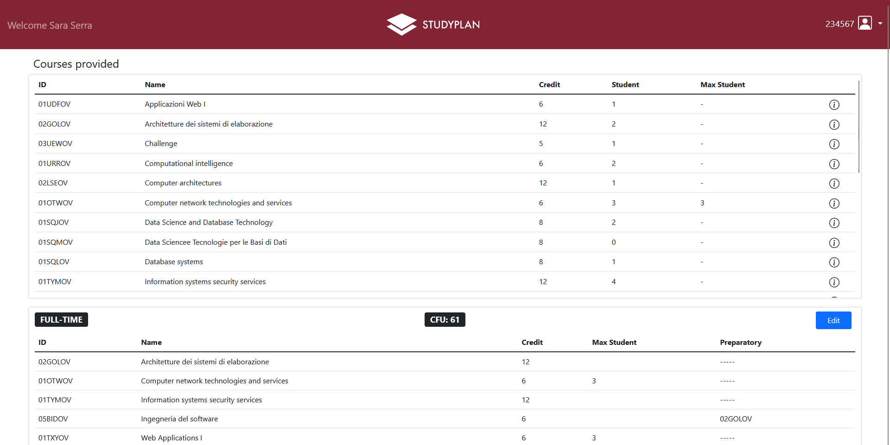
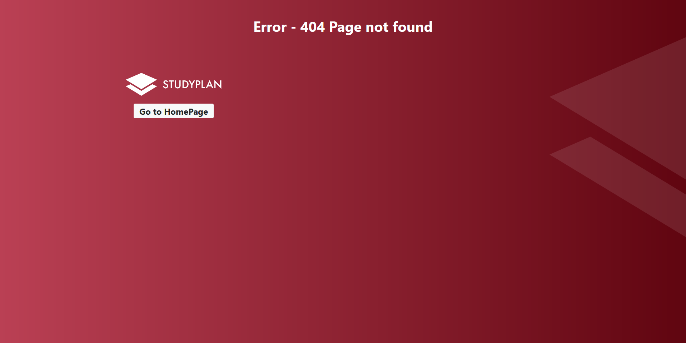
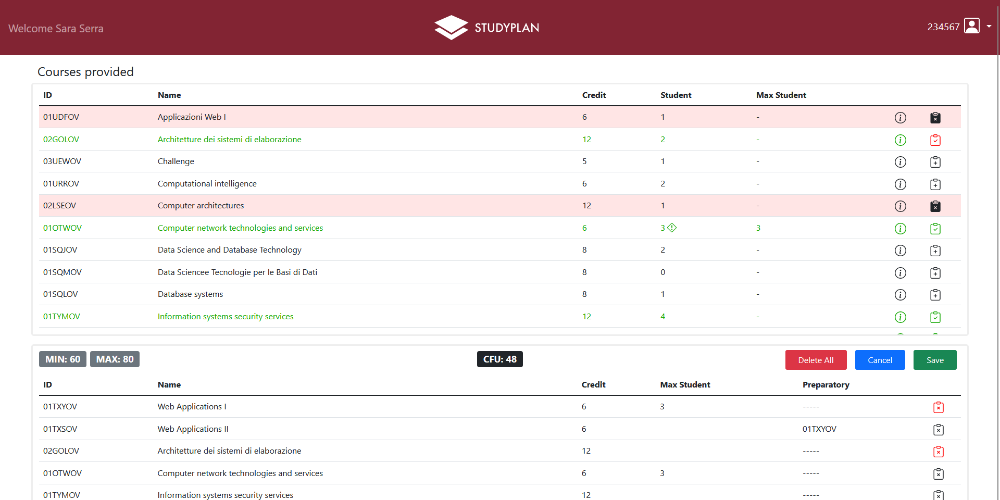

# Exam #1: "StudyPlan"
## Student: CHESSA MARCO 

## React Client Application Routes

- Route `/`:  home page of the site. For non-logged in users it allows the display of the list of courses provided; for logged-in users, in addition to it, it allows the management of the study plan
- Route `/login`: autentication page for a student, after this, the viewing and modification of study plans will be enabled.
- Route `/* (404)`: page displayed when trying to reach an invalid route

## API Server

### **Autentication**
- __Login__
* URL: `/api/login`
* HTTP Method: POST
* Description: Authenticate the user
* Request body: 
```json
{
	"username" : "s123456@polito.it",
	"password" : "password"
}
```
* Response: `200 OK`(success)
* Response body: 
```json
{
	"ID": "123456",
	"NAME": "Marco",
  	"SURNAME": "Chessa",
	"EMAIL": "s123456.rossi@polito.it",
	"TYPE": "1"
}
```
- __Logout__
* URL: `/api/logout`
* HTTP Method: POST
* Description: Logout of logged user
* Request body: _None_
* Response: `200 OK`(success) or `400 Bad Request` (not authenticated)
* Response body: _None_
* Error response: 
```json
For 400 Bad Request status:
{
	"message": "Not authenticated"
}
```
### **Courses**

- __Get all courses__
* URL: `/api/courses`
* HTTP Method: GET
* Description: Return the list of the courses provided of the university
* Request body: _None_
* Response: `200 OK`(success) or `500 Internal Server Error` (generic error)
* Response body: 
```json
[
	{
		"ID": "02GOLOV",
		"NAME": "Architetture dei sistemi di elaborazione",
		"CREDIT": 12,
		"STUDENT": 1,
		"MAXSTUDENT": 3,
		"PREPARATORY": "01SQMOV",
		"INCOMPATIBLE": ["01SQLOV", "02GRSOV"],
		"SUCCESSIVE": ["03GRSOV", "01LPLOV"]
	},
	{
		"..."
	}
]
```

### **Plan**
- __Get a plan of a student__
* URL: `/api/plan`
* HTTP Method: GET
* Description: Return the study plan list of the logged student
* Request body: _None_
* Response: `200 OK`(success) or `500 Internal Server Error` (generic error) or `400 Bad Request` (not authenticated)
* Response body: 
```json
[
	{
		"ID": "02GOLOV",
		"NAME": "Architetture dei sistemi di elaborazione",
		"CREDIT": 12,
		"STUDENT": 1,
		"MAXSTUDENT": 3,
		"PREPARATORY": "01SQMOV",
		"INCOMPATIBLE": ["01SQLOV", "02GRSOV"],
		"SUCCESSIVE": ["03GRSOV", "01LPLOV"]
	},
	{
		"..."
	}
]
```
* Error response: 
```json
For 400 Bad Request status:
{
	"message": "Not authenticated"
}
```

- __Insert new plan__
* URL: `/api/plan/`
* HTTP Method: POST
* Description: Create a new study plan
* Request body: 
```json
{
		"ID": "02GOLOV",
		"NAME": "Architetture dei sistemi di elaborazione",
		"CREDIT": 12,
		"STUDENT": 1,
		"MAXSTUDENT": 3,
		"PREPARATORY": "01SQMOV",
		"INCOMPATIBLE": ["01SQLOV", "02GRSOV"],
		"SUCCESSIVE": ["03GRSOV", "01LPLOV"]
	},
	{
		"..."
	}
```
* Response: `201 OK`(success) or `503 Internal Server Error` (generic error) or `400 Bad Request` (not authenticated) or `422 Unprocessable Entity` or `404 Not Found` (one o more courses doesn't exist)
* Response body: _None_
* Error response: 
```json
For 422 Unprocessable Entity:
{
	"err": "Not enough slots in 02GOLOV" 
}
```

- __Modify a plan__
* URL: `/api/plan/`
* HTTP Method: PUT
* Description: Edit the study plan (insert new corses and/or delete courses) of the logged student
* Request body: 
```json
{
		"ID": "02GOLOV",
		"NAME": "Architetture dei sistemi di elaborazione",
		"CREDIT": 12,
		"STUDENT": 1,
		"MAXSTUDENT": 3,
		"PREPARATORY": "01SQMOV",
		"INCOMPATIBLE": ["01SQLOV", "02GRSOV"],
		"SUCCESSIVE": ["03GRSOV", "01LPLOV"]
	},
	{
		"..."
	}
```
* Response: `201 OK`(success) or `503 Internal Server Error` (generic error) or `400 Bad Request` (not authenticated) or `422 Unprocessable Entity` or `404 Not Found` (one o more courses doesn't exist)
* Response body: _None_
* Error response: 
```json
For 422 Unprocessable Entity:
{
	"err": "Not enough slots in 02GOLOV" 
}

For 400 Bad Request status:
{
	"message": "Not authenticated"
}
```

- __Delete a plan__
* URL: `/api/plan/`
* HTTP Method: DELETE
* Description: Delete the study plan of the logged student
* Request body: _None_
* Response: `204 No Content`(success) or `503 Internal Server Error` (generic error) or or `404 Not found` (one o more courses doesn't exist) or `400 Bad Request` (not authenticated) or `422 Unprocessable Entity` 
* Response body: _None_
* Error response: 
```json
For 400 Bad Request status:
{
	"message": "Not authenticated"
}
```
### **Career**

- __Get career list__
* URL: `/api/careers`
* HTTP Method: GET
* Description: Return the career of the logged student
* Request body: _None_
* Response: `200 OK`(success) or `500 Internal Server Error` (generic error)
* Response body: 
```json
[
 {
		"ID": 1,
		"NAME": "part-time",
		"MINCREDIT": 20,
		"MAXCREDIT": 40,
 }
 ,
 {
		"ID": 2,
		"NAME": "full-time",
		"MINCREDIT": 60,
		"MAXCREDIT": 80,
 }
]
```
* Error response: 
```json
For 400 Bad Request status:
{
	"message": "Not authenticated"
}
```

- __Get career type of a student__
* URL: `/api/career`
* HTTP Method: GET
* Description: Return the career of the logged student
* Request body: _None_
* Response: `200 OK`(success) or `500 Internal Server Error` (generic error) or `400 Bad Request` (not authenticated)
* Response body: 
```json
{
	"TYPE": 2
}
```
* Error response: 
```json
For 400 Bad Request status:
{
	"message": "Not authenticated"
}
```

## Database Tables

- Table `STUDENT` - contains ID, NAME, SURNAME, EMAIL, SALT, HASH, TYPE
  - Contains the set of students enabled on the platform
- Table `PLAN` - contains IDSTUDENT, IDCOURSE
  - Contains the set of courses for each student, grouped at the abstract level as a study plan
- Table `COURSE` - contains ID, NAME, CREDIT, STUDENT, MAXSTUDENT, PREPARATORY
  - Contains the set of courses provided by the university with related information including preparatory courses
- Table `INCOMPATIBLE` - contains IDCOURSE, IDCOURSEINC
  - Contains the set of incompatible courses for each reference course
- Table `CAREER` - contains ID, NAME, MINCREDIT, MAXCREDIT 
  - Contains the set of career types that can be chosen by the student
 
	

## Main React Components

- `HomeLayout` (in `App.js`): it contains all the fundamental components which are displayed dynamically according to the user's and study plan's state. On each page you can expand the row to view additional details.

- `NavigationBar` (in `App.js`): contains the app logo that allow to go back to the homepage from any situation, the student information and buttons to login/logout

- `CourseTable` (in `CourseTable.js`): contains the list of courses provided by `CourseRow`

- `CourseRow` (in `CourseRow.js`): contains information about a particular course, via the info button will display the incompatible and preparatory courses by expanding the row. In case of incompatable courses or full slots the row will have a red background and therefore cannot be added, with the associated error message. Finally through the button you can proceed to both insert and remove the course from the study plan (the text of the inserted course will be green)

	#### **Page**:  View of Homelayout with CourseTable and NavigationBar
	

- `AuthComponent` (in `AuthComponent.js`): contains the form to allow login with appropriate controls and alert message
	#### **Page**: View of Login Form
	

- `StudyPlanForm` (in `StudyPlanForm.js`): contains the enrollment form for a study plan, allows the choice between full and part time through buttons
	#### **Page**: View of StudyplanForm
	

- `StudyPlanTable` (in `StudyPlanTable.js`): contains the set of `StudyPlanRow` with a counter for the number of credits and the valid credit range for the chosen career type. It also contains the "Cancel" button to undo the changes made to the career and the "Save" button to store the study plan in the database (in case of errors an alert will be generated below). In the case of an existing study plan it contains the "Delete" button to delete the entire plan and reset the career to its initial state.
  
- `StudyPlanRow` (in `StudyPlanRow.js`): contains the information for a particular course and `CourseAction` related to the removal of it or the related alert if it cannot be removed.
	#### **Page**: View of saved StudyPlan
	

- `Error` (in `Error.js`): shows information about a page not found and allow to retun to homepage
	#### **Page**: Error 404
	

(only _main_ components, minor ones may be skipped)

## Screenshot
### **Required**: edit mode view for a study plan


## Users Credentials

|        USER         | PASSWORD |
| :-----------------: | :------: |
| `s123456@polito.it` | password |
| `s234567@polito.it` | password |
| `s345678@polito.it` | password |
| `s456789@polito.it` | password |
